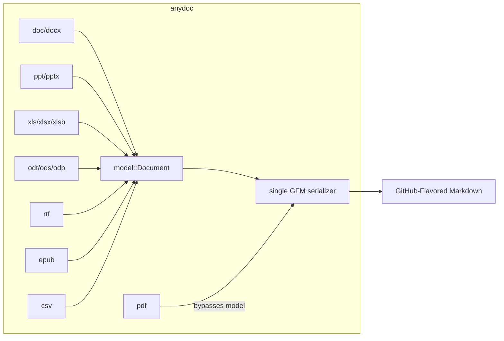
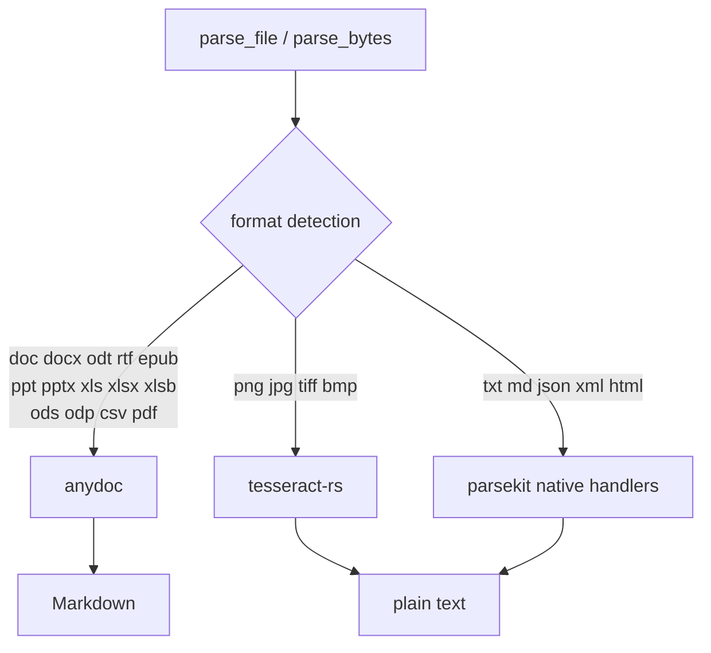

# anydoc Evaluation

**Date:** 2026-09-09
**Question:** Should parsekit adopt [`anydoc`](https://crates.io/crates/anydoc) as its document engine?
**Answer:** Yes — as the office/PDF engine, not as a wholesale replacement.

## What anydoc is

| | |
|---|---|
| Publisher | [Firecrawl](https://firecrawl.dev) (`github.com/firecrawl/anydoc`) |
| License | MIT |
| First release | 2026-07-30 (`0.0.0`), `0.2.4` current |
| Cadence | 15 releases in ~4 weeks |
| Downloads | ~294k |
| Size | ~24k LOC Rust |
| Dependencies | 8, all pure Rust: `cfb`, `csv`, `flate2`, `encoding_rs`, `log`, `pdf-inspector`, `quick-xml`, `zip` |
| MSRV | rustc 1.88 (edition 2024) |
| Cold build | 44s measured on this machine |

It is the engine behind Firecrawl Parse. Existing bindings: Node, Python, WebAssembly. **No Ruby binding exists.**

### Architecture

Every format parses into one shared `model::Document` and renders through a single Markdown
serializer. That is the structural difference from parsekit, which hand-rolls a
`fn(Vec<u8>) -> String` per format with no shared representation.

`model::Document` is small and bindable: 8 `Block` variants (Heading, Paragraph, List, Table,
BlockQuote, CodeBlock, Rule, Math), 8 `Inline` variants (Text, Link, Image, Anchor, NoteRef,
LineBreak, Math, Checkbox), plus `notes` and `assets` (each asset carries `media_type`,
`origin_part`, and raw `bytes`).

**Caveat:** PDF is special-cased. It converts through `pdf-inspector` straight to Markdown and
has no document-model form — `to_document` returns an error for `Format::Pdf`.

## Measured comparison

Both engines run against `spec/fixtures/` on this machine.

| Fixture | parsekit today | anydoc |
|---|---|---|
| `sample.docx` | tables **silently dropped**, bullets flattened | full GFM, `- **Bold text**`, real pipe table |
| `sample.pptx` | one run-on line (hand-rolled XML scrape) | `## Title` per slide + table |
| `sample.xls` | **`RuntimeError: File not found 'xl/_rels/workbook.xml.rels'`** | parses correctly |
| `sample.xlsx` | tab-separated dump | `## Sheet1` + pipe tables |
| `sample.pdf` | flat text, `•` literals | markdown list, bold/italic preserved |
| `sample.html` | naive tag-strip, whitespace soup | **unsupported** |
| `sample.png` | OCR works | **unsupported** |
| `sample.txt` / `.md` | works | **unsupported** |
| `corrupted.pdf` | error | `ConvertError::Malformed` |

The dropped docx tables are not a fixture artifact — `ext/parsekit/src/parser.rs:284` carries a
comment acknowledging tables are skipped because `docx-rs` makes them awkward.

### Performance

Speed is **not** the argument for switching. 400 conversions (pdf + docx + pptx + xlsx, ×100):

| | Time | Per doc |
|---|---|---|
| parsekit (incl. Ruby overhead) | 548 ms | ~1.4 ms |
| anydoc (Rust only) | 395 ms | ~1.0 ms |

## What anydoc gains us

- **Correctness** on docx tables, pptx structure, and xls (fixes a live bug).
- **Structure**: headings, nested lists with source numbering, merged-cell tables, footnotes/endnotes, speaker notes, equations as LaTeX.
- **New formats for free**: `.doc`, `.rtf`, `.odt`, `.ods`, `.odp`, `.epub`, `.xlsb`, `.docm`, `.pptm`.
- **Markdown output**, which is what LLM ingestion actually wants — parsekit's whole reason to exist in the ruby-nlp ecosystem.
- **Drops MuPDF**, one of two statically-linked C dependencies in the build.
- **Typed errors** with a stable `code()`; `NeedsOcr { pages, page_count }` names exactly which pages need OCR.
- **Deletes most of `parser.rs`** — roughly 450 of 630 lines.

## What anydoc does not do

| Gap | Consequence for parsekit |
|---|---|
| **No OCR, no image formats** | Must keep `tesseract-rs` + `image`. This is parsekit's differentiator. |
| **No HTML, XML, JSON, plain text** | Must keep those handlers (`quick-xml`, `serde_json`, `encoding_rs`). |
| **Scanned PDFs error with `NeedsOcr`** | Firecrawl's answer is "POST it to our hosted API" — not an answer parsekit can adopt. |
| **PDF has no document model** | `to_document` unusable for PDFs; Markdown only. |
| **CSV must be named explicitly** | Carries no signature; `from_bytes` returns `None`. |
| **MSRV 1.88 / edition 2024** | Floors the Rust toolchain for source installs. |

Verified behavior: `.txt`, `.md`, `.html`, `.json`, and empty files all return
`ConvertError::Unsupported`. CSV renders as a **Markdown table**, not plain text — a behavior
change from parsekit's current CSV-as-text.

## Risks

1. **Young and pre-1.0.** Six weeks old, `0.2.x`, `#[non_exhaustive]` error enum. Breaking changes are likely.
2. **Vendor alignment.** Firecrawl is VC-backed and sells the hosted Parse API that the OSS crate funnels into. The OSS crate is plausibly a acquisition funnel.
   *Mitigation:* MIT-licensed and vendorable; the parts we depend on are boring format parsers, not anything requiring their servers. The `ocr: hosted` path exists only in the Node/Python bindings — **the Rust crate never makes network calls** (confirmed in `lib.rs`; no HTTP dependency in the tree).
3. **Transitive PDF stack.** `pdf-inspector` (also Firecrawl) pulls `lopdf`, `rayon`, `ttf-parser`, `unicode-normalization`. Its `pyo3` dependency is `optional = true` and does **not** resolve into the tree — verified absent from a real `Cargo.lock` built against `anydoc 0.2.4`.

## Recommendation

Adopt anydoc for office + PDF. Keep Tesseract for images. Keep the text/JSON/XML/HTML handlers.

This is a "replace the engine, keep the shell" move. See [PARSEKIT_1_0_PLAN.md](PARSEKIT_1_0_PLAN.md)
for the migration plan.
