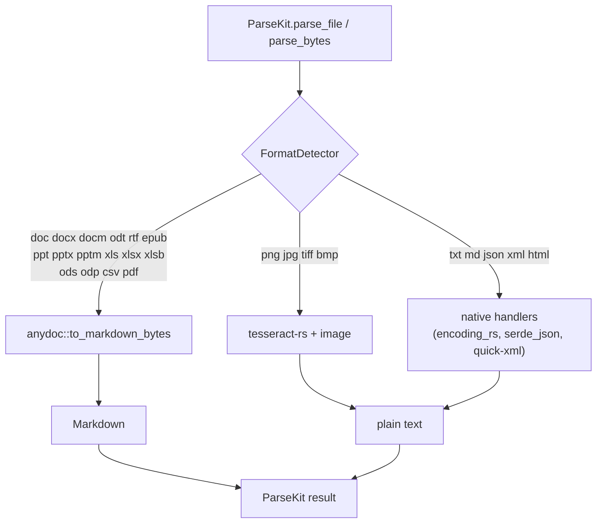

# ParseKit 1.0 — Migration Plan

**Status:** Draft for review. Open questions at the bottom must be answered before Phase 1.
**Companion doc:** [ANYDOC_EVALUATION.md](ANYDOC_EVALUATION.md)

## Why 1.0 now

Two things land together, and each one alone is a major-version event:

1. **Output format changes** from plain text to Markdown for document formats.
2. **The engine changes** from six hand-rolled extractors to `anydoc`, which also fixes
   long-standing correctness bugs (dropped docx tables, broken `.xls`) that consumers may have
   worked around.

Separately and first, `main` has to be made to compile again — see the next section.

## Blocker discovered during planning: `main` does not compile

`bundle exec rake compile` fails on a clean checkout of `main` with 5 errors, all from the
**quick-xml 0.41 → 0.42** bump:

```
src/parser.rs:393  error[E0308]  expected `&[u8]`, found `&str`
src/parser.rs:400  error[E0599]  no method named `decode` on `BytesText<'_>`
src/parser.rs:401  error[E0282]  type annotations needed
src/parser.rs:411  error[E0308]  expected `&[u8]`, found `&str`
src/parser.rs:478  error[E0599]  no method named `decode` on `BytesText<'_>`
```

Two breaking changes in quick-xml 0.42 cause all five:

1. `LocalName` now implements `AsRef<str>` rather than `AsRef<[u8]>`, so the
   `std::str::from_utf8(...)` wrapper no longer type-checks.
2. `BytesText` now holds an already-decoded `Cow<'i, str>`; `decode()` is gone, replaced by
   `xml10_content()` / `xml11_content()` / `html_content()`, which also unescape entities.

### How it got in

PR #51 (`Bump quick-xml from 0.41.0 to 0.42.0`) was **merged on 2026-09-05 with a failing `build`
check** (`conclusion: FAILURE`, run 33399539218). The other seven recent dependabot PRs (#44–#50)
all merged green, so this is an isolated slip rather than a systemic gap.

### Fix

7 insertions, 8 deletions in `ext/parsekit/src/parser.rs`. Verified locally: `cargo check` clean,
extension builds, and **334 examples, 0 failures**.

Notably, **4 of the 5 errors are in `extract_text_from_slide_xml`** — the hand-rolled pptx
scraper that the anydoc migration deletes outright. Only the `parse_xml` site (line 478) is in
code that survives.

> **Action:** ship the fix as its own PR against `main`. The released `0.2.0` predates the
> quick-xml bump and is unaffected, so **no patch release is required** — this is a
> broken-main fix, not a broken-gem fix.

### Correction to an earlier read

An initial pass against the checked-out `lib/parsekit/parsekit.bundle` showed 195/334 specs
failing with `TypeError: no implicit conversion of ParseKit::Parser into ParseKit::Parser`, which
looked like a `#[magnus::wrap]` vs `define_class` registration conflict. **That was an artifact of
a stale build.** The `.bundle` is gitignored and the one on disk dated from 2026-03-24. Rebuilt
from current source, the instance API works correctly and the suite is fully green. There is no
class-registration bug; `parser.rs:597`'s `define_class` pattern is fine as written.

## Third bug found while planning: XML/HTML entities are silently dropped

`parse_xml` loses every entity reference:

```ruby
# <r><a>Tom &amp; Jerry</a><b>5 &lt; 10</b></r>
ParseKit.parse_file("ent.xml")
# => "Tom   Jerry 5   10"        # the & and < are simply gone
```

`quick-xml` emits entity references as a distinct `Event::GeneralRef`, and both `parse_xml` and
`extract_text_from_slide_xml` match only `Event::Text`, letting `_ => {}` swallow them.

**This is pre-existing, not a quick-xml 0.42 regression** — `GeneralRef` exists in 0.41 too, and
the fix in Phase 0 does not touch that match arm.

It matters for 1.0 because **`parse_xml` is code the migration keeps** — anydoc has no HTML or XML
support, so this lane stays ours. Any document with `&amp;`, `&lt;`, `&nbsp;`, or a numeric
character reference is currently silently corrupted, and HTML is entity-dense in practice.

Fix: handle `Event::GeneralRef` by resolving the standard five XML entities plus numeric
references. Slot into Phase 3 or 5, with specs, since `extract_text_from_slide_xml` is deleted by
then and only `parse_xml` needs it.

## Target architecture



### Dependency delta in `ext/parsekit/Cargo.toml`

| Action | Crate | Note |
|---|---|---|
| **add** | `anydoc = "0.2"` | office + PDF engine |
| **remove** | `mupdf` | PDF text extraction now via anydoc/pdf-inspector |
| **remove** | `docx-rs` | superseded |
| **remove** | `calamine` | superseded |
| **remove** | `zip` | only used by the hand-rolled pptx scrape |
| **remove** | `regex` | only used by the pptx scrape |
| **keep** | `tesseract-rs`, `image` | OCR — anydoc has none |
| **keep** | `quick-xml`, `serde_json`, `encoding_rs` | html/xml, json, text |
| **keep** | `magnus` | bindings |

Net: one statically-linked C dependency (MuPDF) removed, four Rust crates removed, one added.
Tesseract stays, so the build still compiles C — the gem does not become pure Rust.

### Code delta

`ext/parsekit/src/parser.rs` is 630 lines. `parse_pdf`, `parse_docx`, `parse_pptx`,
`parse_xlsx`, and `extract_text_from_slide_xml` account for roughly 450 of them and all collapse
into one `anydoc::to_markdown_bytes` call plus error mapping.

## API design for 1.0

### `ParseKit::Document`

`parse_file` and `parse_bytes` return a `Document` rather than a `String`. This is the largest
break in 1.0 and the main reason it is 1.0.

```ruby
doc = ParseKit.parse_file("report.docx")

doc.markdown    # => "## Q3 Results\n\n| Region | Revenue |\n| --- | --- |\n..."
doc.text        # => plain text, Markdown structure stripped
doc.format      # => :docx
doc.assets      # => [#<ParseKit::Asset media_type="image/png", bytes=...>]
doc.to_s        # => same as #markdown
```

Design notes:

- **`#to_s` delegates to `#markdown`**, so string interpolation, `puts`, and logging keep working
  unchanged. This softens the break considerably for the most common casual usage.
- **Every lane returns a `Document`**, not just the anydoc ones. An OCR'd PNG returns a `Document`
  with `format: :png`, its OCR output in both `#markdown` and `#text`, and `assets: []`. A `.txt`
  behaves the same way. One return type, no conditionals at the call site.
- **`#assets`** is populated only for anydoc formats, which retain embedded image bytes with media
  types. This is the capability a bare `String` could not express and the reason the object won.
- **PDF caveat:** anydoc's `to_document` is unsupported for PDFs — they convert straight to
  Markdown. So `format: :pdf` yields `assets: []` always. Worth stating in the README so it does
  not read as a bug.

### Upgrade path

```ruby
# 0.2.0
text = ParseKit.parse_file("report.docx")

# 1.0 — explicit
text = ParseKit.parse_file("report.docx").text        # plain text, as before-ish
md   = ParseKit.parse_file("report.docx").markdown    # new, richer

# 1.0 — unchanged by accident, thanks to #to_s
puts ParseKit.parse_file("report.docx")
```

Note that `.text` is *not* byte-identical to 0.2.0 output — the underlying extraction is better
(tables no longer vanish). The upgrade guide must say so plainly rather than implying a drop-in.

### Errors

`anydoc::ConvertError` maps onto a real exception hierarchy instead of bare `RuntimeError`:

| `ConvertError` | ParseKit exception |
|---|---|
| `Unsupported` | `ParseKit::UnsupportedFormatError` |
| `NeedsOcr { pages, page_count }` | `ParseKit::NeedsOcrError` (exposes `#pages`, `#page_count`) |
| `Malformed { part, detail }` | `ParseKit::MalformedDocumentError` |
| `Encrypted` | `ParseKit::EncryptedDocumentError` |
| `ResourceLimit { limit, detail }` | `ParseKit::ResourceLimitError` |
| `MissingPart { part }` | `ParseKit::MalformedDocumentError` |
| `Io` | `ParseKit::IOError` |

`NeedsOcrError#pages` is genuinely useful: it names which pages of a scanned PDF need OCR, which
is the input to whatever rasterize-and-OCR path we decide on (Open Question 1).

### Behavior changes

| Input | 0.2.0 | 1.0 |
|---|---|---|
| **return type of `parse_file`** | `String` | `ParseKit::Document` (`#to_s` → Markdown) |
| **`parse_pdf/docx/pptx/xlsx`** | public methods | removed |
| `.docx` with a table | table dropped | GFM pipe table |
| `.xls` | `RuntimeError` | parses |
| `.csv` | plain text | GFM pipe table |
| `.pptx` | one run-on line | headings + tables per slide |
| scanned `.pdf` | `"PDF contains no extractable text..."` string | raises `NeedsOcrError` |
| `.doc .rtf .odt .ods .odp .epub .xlsb` | unsupported | supported |

The scanned-PDF row is the sharpest edge: 0.2.0 returns a **sentinel string that reads like
content**, which any consumer indexing output would happily embed. Raising is strictly better,
but it is a breaking change for anyone who string-matched it.

## Phases

Each phase is one PR, green before the next starts.

| # | Phase | Contents | Ships as |
|---|---|---|---|
| 0 | **Unbreak `main`** | quick-xml 0.42 fixes in `parser.rs`; 334/334 green | main fix, no release |
| 1 | **Characterization specs** | Pin current output for every fixture *before* changing engines, so the diff is visible and reviewable | — |
| 2 | **anydoc spike: docx only** | Add `anydoc`, route `Docx` through it, keep everything else. Smallest honest test of the integration. | — |
| 3 | **Full office + PDF cutover** | Route pptx/xlsx/xls/pdf/csv + new formats; delete `mupdf`, `docx-rs`, `calamine`, `zip`, `regex`; drop ~450 lines | — |
| 4 | **Error hierarchy** | Map `ConvertError` → ParseKit exception classes | — |
| 5 | **`ParseKit::Document`** | New return type across all lanes; `#to_s` → `#markdown`; drop `parse_pdf`/`parse_docx`/`parse_pptx`/`parse_xlsx`; expose `#assets` | — |
| 6 | **Docs + platform matrix** | README, CHANGELOG, upgrade guide; add `aarch64-linux` to the release matrix | — |
| 7 | **Release** | Version bump, tag, precompiled matrix via `rust-gem-release` | `1.0.0` |

### Release-pipeline implications

`.github/workflows/release.yml` documents the linux precompiled legs as needing no extra system
deps because the stock `rb-sys-dock` image already carries `cmake` + `clang/libclang` for
**mupdf-sys** and the bundled Tesseract build. Dropping MuPDF removes one of those two reasons.
Tesseract still needs them, so **the workflow comments need updating but the setup does not
change**. The build should get materially faster.

The workflow's standing runtime note still applies unchanged: precompiled gems do not bundle
`eng.traineddata`, so OCR needs system tessdata via `TESSDATA_PREFIX`.

MSRV rises to **rustc 1.88** (anydoc is edition 2024). This affects source installs only;
precompiled platform gems are unaffected. Worth stating in the gemspec and README.

## Spec coverage plan

Per the standing rule that a refactor needs enough coverage to prove it did not break anything.
The suite is 334 examples / 0 failures once `main` compiles, with 95.28% line and 94.05% branch
coverage — but the green is partly **load-bearing on bugs**, which the migration will flip red.

Two concrete instances found while planning:

- **`integration_spec.rb:61` asserts the `.xls` failure.** It wraps the call in
  `raise_error(RuntimeError, /Failed to parse Excel file/)` with a comment that "XLS support needs
  improvement." When anydoc makes `.xls` work, this spec fails **because the bug is fixed**. It
  must be inverted, not deleted.
- **`integration_spec.rb:24` never checks the docx table.** It asserts
  `include("Table example")` — the paragraph label preceding the table — but never `"Column 1"` or
  `"Data A"`. That is exactly how the dropped-table bug stayed green.

Plan:

1. **Phase 1 characterization specs run first.** Every fixture's current output gets pinned before
   the engine changes, so Phase 3's diff is reviewable rather than assumed.
2. **Audit for other bug-asserting specs** before Phase 3, so a migration failure is never
   mistaken for a regression. `error_consistency_spec.rb` is the likeliest other home for these.
3. **New fixtures required** for the formats anydoc adds: `.doc`, `.rtf`, `.odt`, `.ods`, `.odp`,
   `.epub`, `.xlsb`. Without these the new surface ships untested.
4. **A scanned-PDF fixture** is needed — there is currently none, which is why the
   `"contains no extractable text"` sentinel path has no coverage.
5. **Structural assertions**, not just `include?`: assert the pipe table is actually present.
6. `spec/fixtures/` is never deleted wholesale; specs clean up only files they create.

## What happens to the existing specs

Many of the 334 will need rewriting, not because migration breaks them but because they assert
plain-text shapes. Rough triage:

- `ocr_spec.rb`, `encoding_spec.rb` — largely unaffected (Tesseract and text handlers stay).
- `integration_spec.rb`, `simple_parsing_spec.rb`, `pdf_parser_spec.rb` — output assertions need
  updating to Markdown.
- `dispatch_spec.rb`, `format_detection_spec.rb` — dispatch table grows; detection moves toward
  `anydoc::Format::from_bytes`.
- `error_consistency_spec.rb`, `error_handling_spec.rb` — rewritten against the new hierarchy.
- `validation_helpers_spec.rb`, `parser_spec.rb` — depend on Open Questions 2 and 3.

## Decisions

Settled 2026-09-09.

**1. Scanned PDFs — raise, don't OCR. MuPDF is removed entirely.**
anydoc's `NeedsOcr { pages, page_count }` surfaces as `ParseKit::NeedsOcrError` with `#pages` and
`#page_count`. No PDF rasterization in 1.0. Tesseract stays for image formats only. Local
scanned-PDF OCR is a candidate for 1.1, and `#pages` is exactly the input it would need.

**2. `parse_file` / `parse_bytes` return a `ParseKit::Document`.**
The clean API wins over the smaller break. See the Document section above.

**3. Drop `parse_pdf`, `parse_docx`, `parse_pptx`, `parse_xlsx`.**
They would be four names for one anydoc call. `ocr_image`, `parse_text`, `parse_json`, and
`parse_xml` stay — those remain genuinely distinct engines.

**4. CSV renders as a Markdown table.** Accept anydoc's behavior rather than special-casing it
back into the plain-text lane. Documented as a breaking change.

**5. Pin `anydoc = "0.2.4"` exactly.** A six-week-old pre-1.0 crate with a `#[non_exhaustive]`
error enum does not get a caret range. Dependabot already watches this repo and will propose
bumps that CI must pass — which, per the quick-xml incident, means **CI results now need to be
respected on dependabot PRs**.

**6. Add `aarch64-linux` to the release matrix.** Independent of the migration; see
[PARSEKIT_BIN_GEM.md](PARSEKIT_BIN_GEM.md). It is the one platform `parsekit-bin` ships that we
do not, and the `rust-gem-release` workflow already builds `x86_64-linux` from the same stock
`rb-sys-dock` image.
