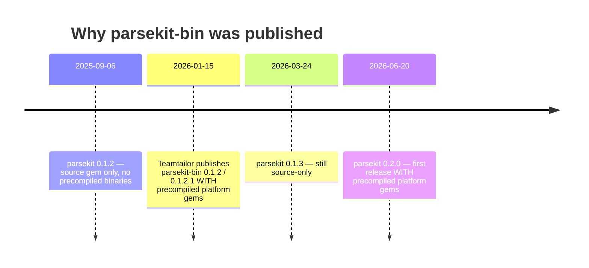

# The `parsekit-bin` gem on RubyGems

**Date:** 2026-09-09
**Short answer:** It is not ours, it is not a mistake of ours, and we cannot yank it.
It is a third-party fork by **Teamtailor** that shipped precompiled binaries before we did.
It is benign but obsolete, and it misattributes authorship.

## What it is

| | `parsekit` | `parsekit-bin` |
|---|---|---|
| RubyGems owner | **`cpetersen`** (id 718) | **`lucas__domeij`** (id 239410) |
| Latest version | 0.2.0 | 0.1.2.1 |
| First published | 2025-08-21 | **2026-01-15** |
| Downloads | 7,888 | 5,246 |
| Platforms | ruby, arm64-darwin, x86_64-linux | ruby, x86_64-linux, aarch64-linux, arm64-darwin-23 |

The gem metadata names its real origin:

```yaml
metadata:
  homepage_uri:    https://github.com/scientist-labs/parsekit
  source_code_uri: https://github.com/scientist-labs/parsekit
  github_repo:     ssh://github.com/Teamtailor/parsekit-bin
```

`Teamtailor` is a Swedish recruitment-software company. `lucas__domeij` is presumably one of their
engineers.

## Why it exists

The timeline explains it completely:



Installing `parsekit` from source compiles **MuPDF and Tesseract 5.3.4 + Leptonica from C
source**. In a CI or container build that is brutal. Teamtailor needed precompiled binaries,
we did not offer them yet, so they forked and shipped their own.

Since our `0.2.0` (2026-06-20) ships precompiled `arm64-darwin` and `x86_64-linux` gems through
the shared `rust-gem-release` workflow, **`parsekit-bin`'s reason to exist is gone** — except that
it still carries `aarch64-linux`, which we do not currently publish.

## Is it malicious?

**No.** Verified directly:

- **Source is byte-identical to our `0.1.2` tag.** Every file diffed clean except two:
  - `lib/parsekit/version.rb` — `"0.1.2"` → `"0.1.2.1"`
  - `ext/parsekit/Cargo.toml` — `calamine "0.30"` → `"0.31"`
- **`extconf.rb` is unmodified** — the usual four-line `create_rust_makefile` and nothing else.
  No install-time hooks, no network fetches.
- **The precompiled `arm64-darwin-23` binary is clean.** It links only `libSystem.B.dylib`,
  `libiconv.2.dylib`, and `libc++.1.dylib` — no networking libraries. Every embedded URL string
  is an OOXML/W3C XML namespace (`schemas.openxmlformats.org`, `www.w3.org/…`), consistent with
  the DOCX/XLSX parsers.

This is a sloppy-attribution fork, not a supply-chain attack.

## The actual problem: attribution

The gem publishes, under an account that is not ours:

- `authors: Chris Petersen`
- `email: chris@petersen.io`
- `homepage`/`source_code_uri` pointing at `scientist-labs/parsekit`
- our `summary` and `description` verbatim

So a gem we do not control lists our name and email as the contact, and points users at our
issue tracker for bugs in a build we did not produce. That is the part worth fixing — not
because of risk, but because bug reports for their artifact land on us.

## Options

We **cannot yank it** — yanking requires ownership, and `parsekit-bin` is owned by
`lucas__domeij`. Realistic paths:

1. **Do nothing.** It is pinned to our `0.1.2` and its users are frozen on old code. Low harm.
2. **Open a friendly issue on `Teamtailor/parsekit-bin`** (recommended). Note that `parsekit`
   now ships precompiled gems, ask them to deprecate `parsekit-bin` in favor of upstream, and ask
   that the author/email metadata be changed to theirs while it remains published.
3. **Add `aarch64-linux` to our release matrix.** This removes the last real reason for anyone to
   prefer `parsekit-bin`, and Teamtailor's need is direct evidence of demand. Cheap to do — the
   `rust-gem-release` workflow already builds `x86_64-linux` with the same stock `rb-sys-dock`
   image.
4. **Defensive registration** of `parsekit-bin` is not available (already taken). Consider
   registering obvious sibling names we would never want squatted if we care — though note no
   other `-bin` variants exist for `tokenkit`, `phrasekit`, `red-candle`, or `lancelot`, so this
   is not a pattern anyone is farming.

## Decision (2026-09-09)

**Ship `aarch64-linux` ourselves. Take no action against Teamtailor.**

The fork is benign, its users are frozen on our `0.1.2`, and the misattribution is not worth a
confrontation. The one thing worth acting on is the actual gap it exposes: they needed an
`aarch64-linux` precompiled gem badly enough to fork, and we still do not publish one. That is
demand evidence, not a threat.

Tracked as Phase 6 of [PARSEKIT_1_0_PLAN.md](PARSEKIT_1_0_PLAN.md). The `rust-gem-release`
workflow already builds `x86_64-linux` from the stock `rb-sys-dock` cross image; `aarch64-linux`
uses the same image family and needs no extra system deps, so this should be a matrix addition
rather than new build engineering.

Revisit only if they publish a version tracking our `0.2.x` or later — at that point the
attribution question becomes live again.
